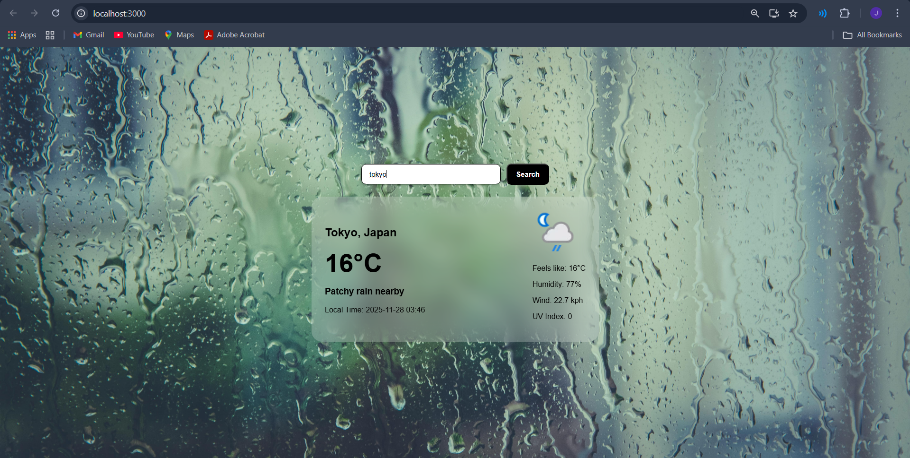
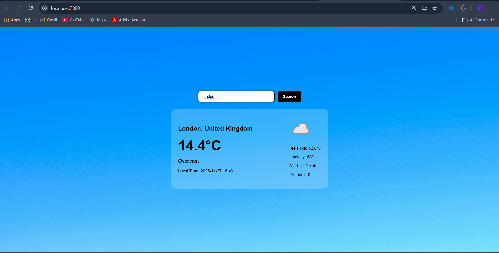
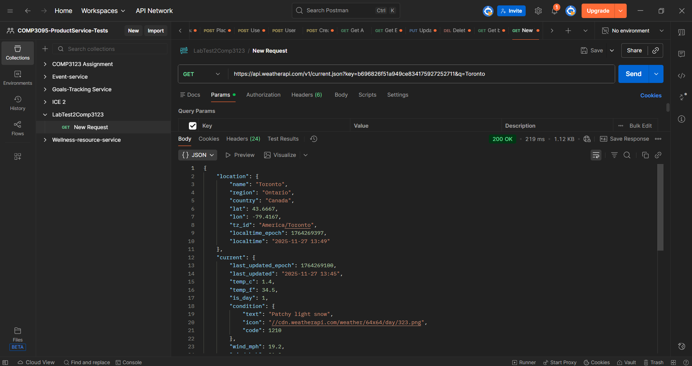
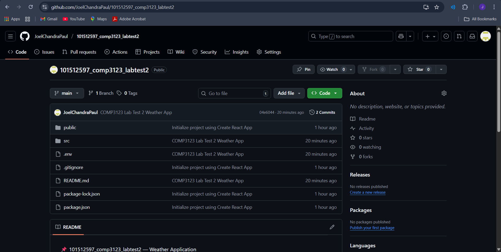
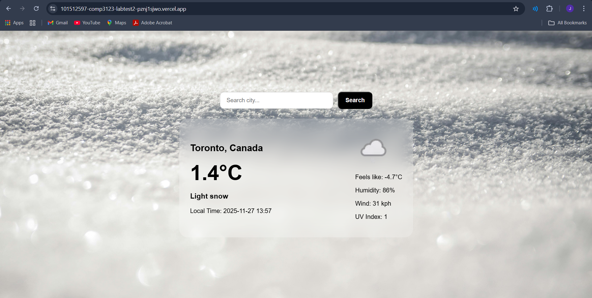

# 🌦 COMP3123 — Lab Test 2 — Weather App
**Name:** Joel Chandra Paul  
**Student ID:** 101512597  

---

## 🔗 Live Application  
https://101512597-comp3123-labtest2-pznj1sjwo.vercel.app  

## 🔗 GitHub Repository  
https://github.com/JoelChandraPaul/101512597_comp3123_labtest2  

---

## 📌 Project Summary  
This React Weather Application retrieves real-time weather data using WeatherAPI.com.  
Users can search for any location and view:

- Temperature (°C)
- Weather Condition + Icon
- City + Country
- Local Time
- Feels Like Temperature
- Humidity
- Wind Speed
- UV Index

Background dynamically updates based on weather.

---

## 💻 Technologies Used

| Technology | Purpose |
|----------|---------|
| React.js | Front-end Application |
| WeatherAPI.com | Weather Data API |
| CSS + Glassmorphism UI | Styling & Layout |
| GitHub | Version Control |
| Vercel | Deployment Hosting |

---

## 🔥 Features Implemented

| Feature | Status |
|--------|--------|
| API Fetch (WeatherAPI) | ✔ |
| Search City Dynamically | ✔ |
| Weather Icons & Data Display | ✔ |
| Weather-Based Background Change | ✔ |
| React Hooks (useState, useEffect) | ✔ |
| Props Between Components | ✔ |
| Fully Responsive UI | ✔ |
| Deployed Live Online | ✔ |

---

## 🖼 Application Screenshots

### 🔹 Default Screen (Toronto)


### 🔹 Search — Tokyo


### 🔹 Search — London


### 🔹 Background Theme Variation


### 🔹 Postman API Response (Success)


### 🔹 GitHub Repo Structure


### 🔹 Live Deployment Screenshot


---


### 🌍 API Source

Weather Data Provider → https://www.weatherapi.com/

## 🛠 How to Run Locally

```bash
git clone https://github.com/JoelChandraPaul/101512597_comp3123_labtest2
cd 101512597_comp3123_labtest2
npm install
Create .env in project root:

REACT_APP_API_KEY=YOUR_API_KEY


Start Application:

npm start